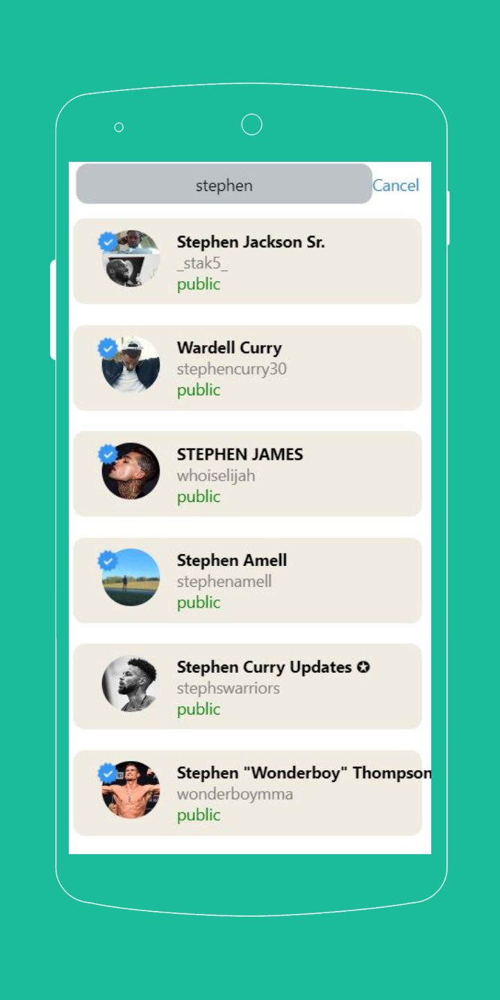

# INSTAGRAM & REACT NATIVE

A JS ( REACT NATIVE ) app that fetch instagram users depend on query from textInput real time using the open API for instagram and displaying the JSON respons on a flatlist components as mentioned in the screenshot below

|                     UI Preview                     |                     UI Preview                     |
| :------------------------------------------------: | :------------------------------------------------: |
|  |  |

Made with ❤ and React native
by : <a href= 'https://www.linkedin.com/in/ilies-ould-menouer-6a02111a2/' >ilies Ouldmenouer</a>
